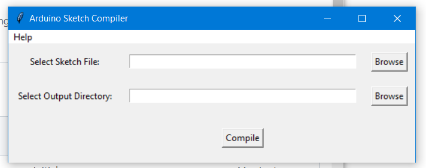
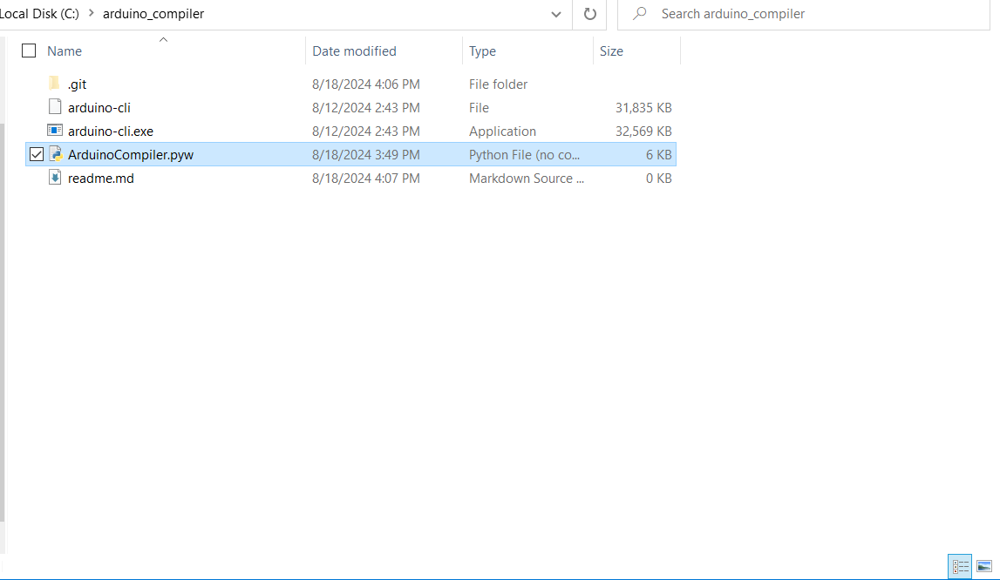
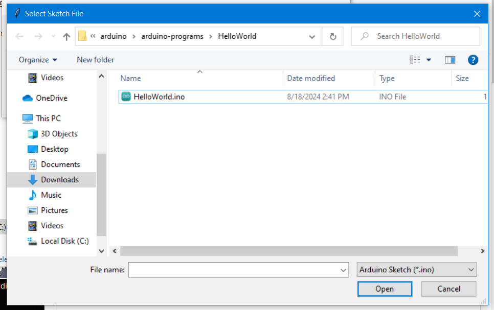
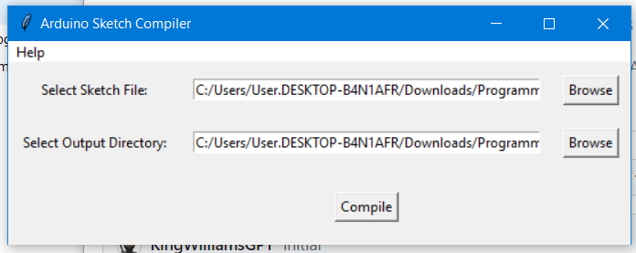
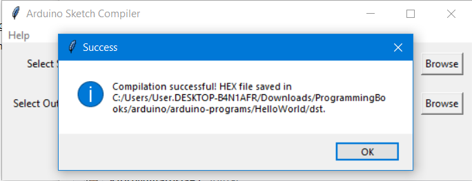
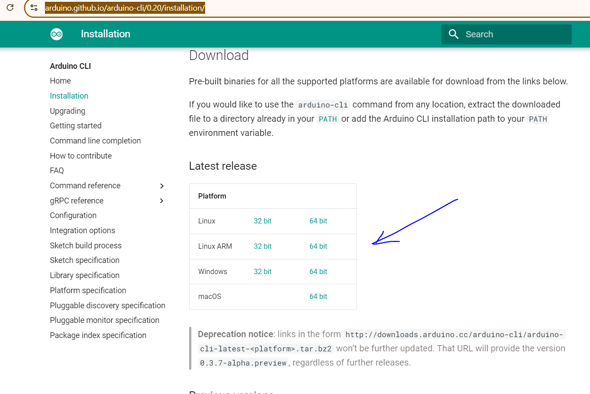

# Arduino Compmiler



once you have downloaded it from this repo, your directory should look something like this




next right click on `ArduinoCompiler.py` then click `send to` then select `Desktop (create shortcut)` to send this file to your desktop as a shortcut that way its easier work with.


Next select the path to your arduino sketch file.


everything should look like this


it should compile successfully.

### Note
it works on only Windows and Linux

for any other platform goto [This Path](https://arduino.github.io/arduino-cli/0.20/installation/)


select your platform and download it

Add the executable [to path](https://helpdeskgeek.com/windows-10/add-windows-path-environment-variable/) then run this.
```bash
arduino-cli compile --fqbn arduino:avr:uno --output-dir "output_dir" "sketch_file"
```